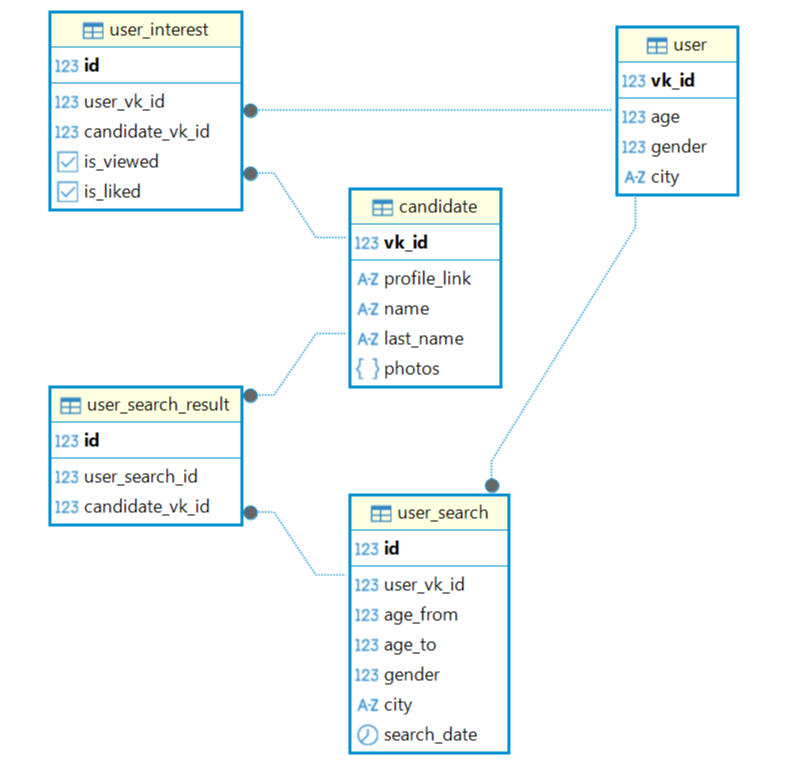

# VKinder

Бот для ВКонтакте, который подбирает людей для знакомств, показывает информацию о кандидатах и сохраняет избранных в базе
данных.

## Возможности

- поиск кандидатов по данным пользователя (пол — противоположный, город — тот
  же, возраст ± настраиваемое отклонение);
- показ кандидата: имя и фамилия, ссылка на профиль, три самые популярные
  фотографии (по количеству лайков) в виде `attachment`;
- кнопки «В избранное», «Далее», «Избранные», «Новый поиск»;
- сохранение профиля, поисков, кандидатов и реакций в PostgreSQL;
- повторный поиск не показывает уже просмотренных и добавленных в избранное.

## Структура проекта

```
config.py                  настройки из .env (БД и VK)
main.py                    точка входа
database/                  работа с БД
    db_model.py            модели SQLAlchemy
    db_engine.py           движок и декораторы сессий
    db_utils.py            функции доступа к данным
vk_service/                взаимодействие с API ВКонтакте
    vk_client.py           users.get / users.search / photos.get / messages.send
    vk_utils.py            сервисные функции для vk_client
    keyboards.py           клавиатуры с кнопками
bot/                       логика бота
    handlers.py            обработка команд и кнопок
    repository.py          доступ к данным (обертка над database.db_utils)
    states.py              состояния диалога
    bot_utils.py           сервисные функции бота
```

## Требования

- Python 3.10+
- PostgreSQL
- Токены доступа ВКонтакте.
- Включенная настройка Long Poll в сообществе ВКонтакте
  (Управление > Дополнительно > Работа с API > Long Poll API - настройка Включено + Типы событий: Входящее сообщение, Исходящее сообщение, )

## Установка

1. Клонируйте репозиторий и перейдите в папку проекта.

2. Создайте и активируйте виртуальное окружение:

   ```bash
   python -m venv .venv
   # Windows
   .venv\Scripts\activate
   # Linux / macOS
   source .venv/bin/activate
   ```

3. Установите зависимости:

   ```bash
   pip install -r requirements.txt
   ```

4. Создайте базу данных в PostgreSQL (имя по умолчанию — `vkinder`):

   ```sql
   CREATE DATABASE vkinder;
   ```

5. Скопируйте `.env.example` в `.env` и заполните значения:

   ```bash
   cp .env.example .env
   ```

   | Переменная | Описание |
      | --- | --- |
   | `DB_HOST`, `DB_PORT`, `DB_NAME`, `DB_USER`, `DB_PASSWORD` | параметры подключения к PostgreSQL |
   | `VK_GROUP_TOKEN` | токен сообщества (Long Poll, отправка сообщений; по нему определяется ID сообщества) |
   | `VK_USER_TOKEN` | пользовательский токен (`users.get`, `users.search`, `photos.get`) |


## Запуск

```bash
python main.py
```

При первом запуске создаются все таблицы. Затем напишите сообществу любое
сообщение — бот начнёт диалог.

## Как пользоваться

1. Напишите боту «Начать».
2. Бот возьмёт из профиля ВКонтакте пол, город и дату рождения. Если данных не
   хватает, он задаст уточняющие вопросы и сохранит ответы.
3. Бот покажет параметры поиска и предложит первого кандидата.
4. Кнопки:
    - **В избранное** — сохранить кандидата (`user_interest.is_liked`);
    - **Далее** — следующий кандидат (`user_interest.is_viewed`);
    - **Избранные** — список сохранённых;
    - **Новый поиск** — подобрать новых кандидатов.

## База данных

Таблицы:

    • user - информация о пользователях бота  (vk_id, возраст, пол, город)
    • candidate - найденные кандидаты для знакомства (vk_id, имя, фамилия, ссылка на профиль, список фото)
    • user_search - история поисковых запросов пользователя
    • user_search_result - связь поискового запроса и найденных кандидатов
    • user_interest - информация о реакции пользователя на предложенных кандидатов

 

