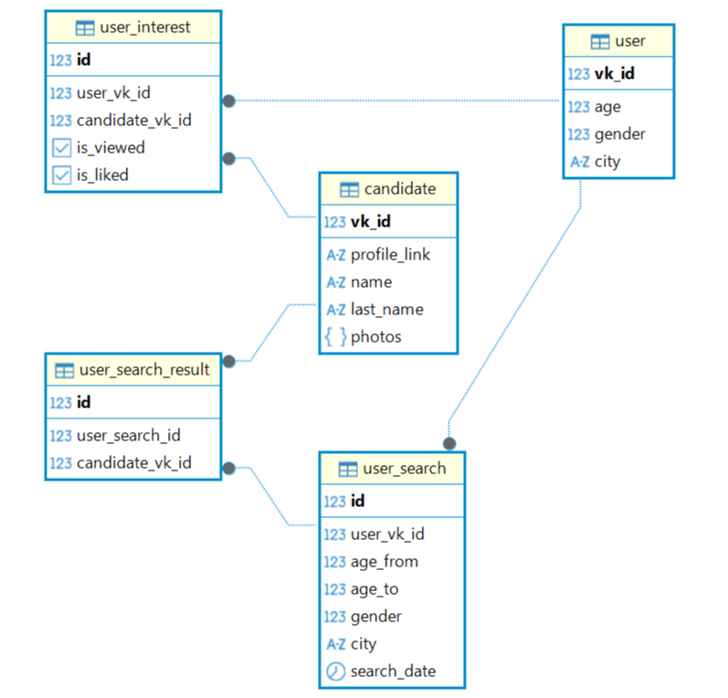

# VKinder

Бот для ВКонтакте, который подбирает людей для знакомств, показывает кандидатов с фотографиями и сохраняет избранных в базе
данных.

**Стек:** Python 3.10+, VK API, PostgreSQL, SQLAlchemy.

## Возможности

- Поиск кандидатов по данным пользователя (пол — противоположный, город — тот
  же, возраст ± настраиваемое отклонение (в данном случае ±3 года));
- Показ кандидата: имя и фамилия, ссылка на профиль, три самые популярные
  фотографии (по количеству лайков) в виде 'attachment';
- Кнопки «В избранное», «Далее», «Избранные», «Новый поиск»;
- Сохранение профиля, поисков, кандидатов и реакций в PostgreSQL;
- Повторный поиск не показывает уже просмотренных и добавленных в избранное.

## Структура проекта

```
VK_bot/
    config.py                  Настройки из .env (БД и VK)
    main.py                    Точка входа
    .env.example               Шаблон переменных окружения
    requirements.txt           Зависимости
    database/                  Работа с БД
        db_model.py            Модели SQLAlchemy
        db_engine.py           Движок и декораторы сессий
        db_utils.py            Функции доступа к данным
    vk_service/                Взаимодействие с VK API
        auth.py                Авторизация в VK
        users.py               Данные пользователей и поиск
        photos.py              Фотографии
        utils.py               Вспомогательные функции
        vk_client.py           Клиент VK для бота (LongPoll, отправка)
        keyboards.py           Клавиатуры с кнопками
    bot/                       Логика бота
        handlers.py            Обработка команд и кнопок
        repository.py          Доступ к данным (обертка над database.db_utils)
        states.py              Состояния диалога
        bot_utils.py           Сервисные функции бота
    examples/                  Проверочные скрипты (этап 1)
        check_auth.py
        check_age.py
        check_size.py
        check_info.py
        check_search.py
        check_photos.py
        check_full.py
```

## Требования

- Python 3.10+
- PostgreSQL
- Токены доступа ВКонтакте.
- Включенная настройка Long Poll в сообществе ВКонтакте
  (Управление > Дополнительно > Работа с API > Long Poll API - настройка Включено + Типы событий: Входящее сообщение, Исходящее сообщение)

## Установка

1. Клонируйте репозиторий и перейдите в папку проекта.

2. Создайте и активируйте виртуальное окружение:

   ```bash
   python -m venv .venv
   # Windows
   .venv\Scripts\activate
   # Linux / macOS
   source .venv/bin/activate
   ```

3. Установите зависимости:

   ```bash
   pip install -r requirements.txt
   ```

4. Создайте базу данных в PostgreSQL (имя по умолчанию — `vkinder`):

   ```sql
   CREATE DATABASE vkinder;
   ```

5. Скопируйте `.env.example` в `.env` и заполните значения:

   ```bash
   cp .env.example .env
   ```

   | Переменная | Описание |
   | --- | --- |
   | `DB_HOST`, `DB_PORT`, `DB_NAME`, `DB_USER`, `DB_PASSWORD` | параметры подключения к PostgreSQL |
   | `VK_GROUP_TOKEN` | токен сообщества (Long Poll, отправка сообщений; по нему определяется ID сообщества) |
   | `VK_USER_TOKEN` | пользовательский токен (`users.get`, `users.search`, `photos.get`) |


## Запуск

```bash
python main.py
```

При первом запуске создаются все таблицы. Затем напишите сообществу любое
сообщение — бот начнёт диалог.

## Как пользоваться

1. Напишите боту «Начать».
2. Бот возьмёт из профиля ВКонтакте пол, город и дату рождения. Если данных не
   хватает, он задаст уточняющие вопросы и сохранит ответы.
3. Бот покажет параметры поиска и предложит первого кандидата.
4. Кнопки:
    - **В избранное** — сохранить кандидата;
    - **Далее** — следующий кандидат;
    - **Избранные** — список сохранённых;
    - **Новый поиск** — подобрать новых кандидатов.

## База данных

Таблицы:

- **user** - информация о пользователях бота  (vk_id, возраст, пол, город);
- **candidate** - найденные кандидаты для знакомства (vk_id, имя, фамилия, ссылка на профиль, список фото);
- **user_search** - история поисковых запросов пользователя;
- **user_search_result** - связь поискового запроса и найденных кандидатов;
- **user_interest** - информация о реакции пользователя на предложенных кандидатов.

 
